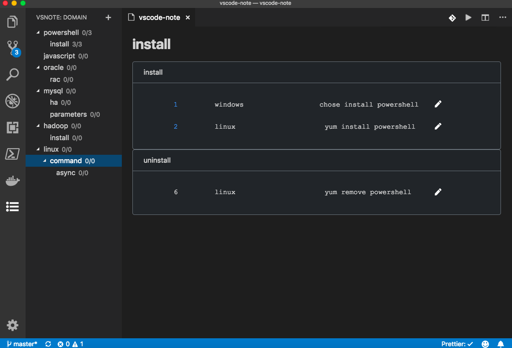

[](https://marketplace.visualstudio.com/items?itemName=shinhwagk.vscode-note)

# vscode-note

This extension provides a simple note-taking. Make notes closer to the vscode extensions.

## Features
* each ***domain***(directory tree) node can be a ***notes***.
* each ***notes*** consists of one or more ***category***.
* each ***category*** consists of one or more ***note***.
* each ***note*** consits of one or more ***short doc***, ***doc***(markdown/html), ***files***(attachment)

## Usages

- create a note

- Create a note related document

- Create a note related files

## note data default directory

> ~/vscode-note
- currently recommend use onedrive to store/sync your notes.
- future: can use github to store/sync/share your notes.

## note data structure
```
/path/to/your/data_directory
├─┬ note1
│ ├── 1.txt
│ ├── 2.txt
│ ├── *.txt
│ ├── .n.yml
│ ├─┬ doc
│ │ ├── README.md
│ │ ├── images.jpg
│ │ └── …
│ └─┬ files
│   ├── eample.sh
│   ├── Dockerfile
│   └── …
└─┬ note2
  ├── 1.txt
  ├── 2.txt
  └── …
```

## screenshot


