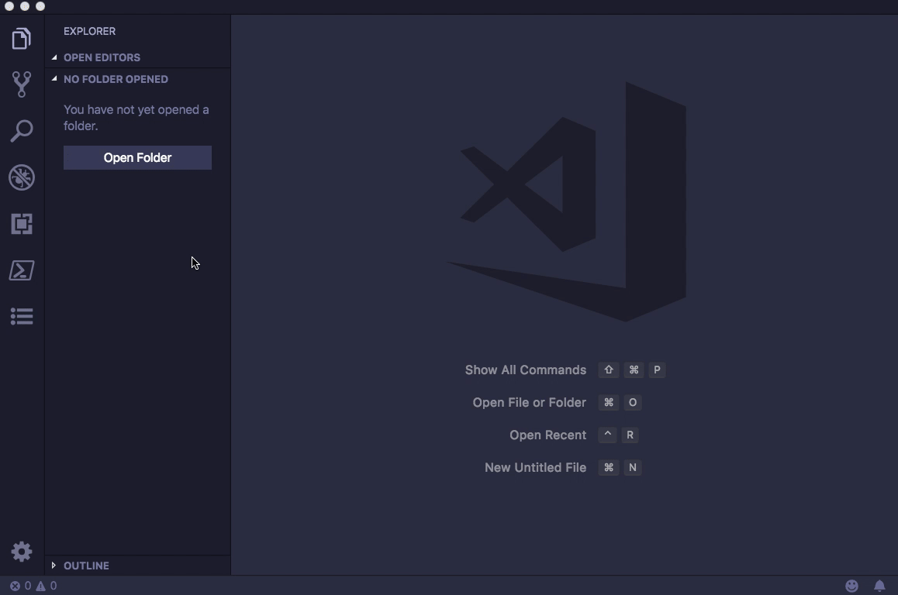

[](https://marketplace.visualstudio.com/items?itemName=shinhwagk.vscode-note)

# vscode-note

This extension provides a simple note-taking. Make notes closer to the vscode extensions.

## Features

-   each **_domain_**(directory tree) node can be a **_notes_**.
-   each **_notes_** consists of one or more **_category_**.
-   each **_category_** consists of one or more **_note_**.
-   each **_note_** consists of one or more **_short doc_**, **_doc_**(markdown/html), **_files_**(attachment)

## Usages



## note data default directory

> ~/vscode-note

-   currently recommend use onedrive to store/sync your notes.
-   future: can use github to store/sync/share your notes.

## note data structure

```
/path/to/your/data_directory
├─┬ note1
│ ├── 1.txt
│ ├── 2.txt
│ ├── *.txt
│ ├── .n.json
│ ├─┬ doc
│ │ ├── README.md
│ │ ├── images.jpg
│ │ └── …
│ └─┬ files
│   ├── eample.sh
│   ├── Dockerfile
│   └── …
└─┬ note2
  ├── 1.txt
  ├── 2.txt
  └── …
```
